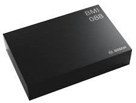

# Isaac ROS IMU

<div align="center"></div>

## Overview

This repository contains ROS driver packages for the the following sensors:

* [BMI088 IMU](https://www.bosch-sensortec.com/products/motion-sensors/imus/bmi088/)

### Isaac ROS NITROS Acceleration

This package is powered by [NVIDIA Isaac Transport for ROS (NITROS)](https://developer.nvidia.com/blog/improve-perception-performance-for-ros-2-applications-with-nvidia-isaac-transport-for-ros/), which leverages type adaptation and negotiation to optimize message formats and dramatically accelerate communication between participating nodes.

## Table of Contents

- [Isaac ROS IMU](#isaac-ros-imu)
  - [Overview](#overview)
    - [Isaac ROS NITROS Acceleration](#isaac-ros-nitros-acceleration)
  - [Table of Contents](#table-of-contents)
  - [Latest Update](#latest-update)
  - [Supported Platforms](#supported-platforms)
    - [Docker](#docker)
  - [Quickstart](#quickstart)
  - [Package Reference (Isaac ROS IMU)](#package-reference-isaac-ros-imu)
    - [Usage](#usage)
    - [ROS Parameters](#ros-parameters)
    - [ROS Topics Published](#ros-topics-published)
  - [Updates](#updates)

## Latest Update
Update 2023-05-25: Add support for BMI088 IMU

## Supported Platforms

This package is designed and tested to be compatible with ROS 2 Humble running on [Jetson](https://developer.nvidia.com/embedded-computing).

> **Note**: Versions of ROS 2 earlier than Humble are **not** supported. This package depends on specific ROS 2 implementation features that were only introduced beginning with the Humble release.

| Platform | Hardware                                                                                                                                                                                               | Software                                                       | Notes                                                                                                                                                                                   |
| -------- | ------------------------------------------------------------------------------------------------------------------------------------------------------------------------------------------------------ | -------------------------------------------------------------- | --------------------------------------------------------------------------------------------------------------------------------------------------------------------------------------- |
| Jetson   | [Jetson Orin](https://www.nvidia.com/en-us/autonomous-machines/embedded-systems/jetson-orin/)<br>[Jetson Xavier](https://www.nvidia.com/en-us/autonomous-machines/embedded-systems/jetson-agx-xavier/) | [JetPack 5.1.1](https://developer.nvidia.com/embedded/jetpack) | For best performance, ensure that [power settings](https://docs.nvidia.com/jetson/archives/r34.1/DeveloperGuide/text/SD/PlatformPowerAndPerformance.html) are configured appropriately. |

### Docker

To simplify development, we strongly recommend leveraging the Isaac ROS Dev Docker images by following [these steps](https://github.com/NVIDIA-ISAAC-ROS/isaac_ros_common/blob/main/docs/dev-env-setup.md). This will streamline your development environment setup with the correct versions of dependencies on both Jetson and x86_64 platforms.

> **Note**: All Isaac ROS Quickstarts, tutorials, and examples have been designed with the Isaac ROS Docker images as a prerequisite.

## Quickstart

1. Set up your development environment by following the instructions [here](https://github.com/NVIDIA-ISAAC-ROS/isaac_ros_common/blob/main/docs/dev-env-setup.md).  
2. Clone this repository and its dependencies under `~/workspaces/isaac_ros-dev/src`.

    ```bash
    cd ~/workspaces/isaac_ros-dev/src
    ```

    ```bash
    git clone https://github.com/NVIDIA-ISAAC-ROS/isaac_ros_common
    ```

    ```bash
    git clone https://github.com/NVIDIA-ISAAC-ROS/isaac_ros_nitros
    ```

    ```bash
    git clone https://github.com/NVIDIA-ISAAC-ROS/isaac_ros_imu
    ```

3. Launch the Docker container using the `run_dev.sh` script:

    ```bash
    cd ~/workspaces/isaac_ros-dev/src/isaac_ros_common && \
      ./scripts/run_dev.sh
    ```

4. Inside the container, build and source the workspace:  

    ```bash
    cd /workspaces/isaac_ros-dev && \
      colcon build --symlink-install && \
      source install/setup.bash
    ```

5. (Optional) Run tests to verify complete and correct installation:  

    ```bash
    colcon test --executor sequential
    ```

6. Run the following launch files to spin up a demo of this package:

    ```bash
    ros2 launch isaac_ros_imu_bmi088 isaac_ros_bmi088.launch.py
    ```
7. Open a second terminal using the `run_dev.sh` script: 
    ```bash
    cd ~/workspaces/isaac_ros-dev/src/isaac_ros_common && \
      ./scripts/run_dev.sh
    ```

8. Echo the output imu stream:
    ```bash
    ros2 topic echo /imu
    ```
## Package Reference (Isaac ROS IMU)
### Usage
```bash
ros2 launch isaac_ros_imu_bmi088 isaac_ros_bmi088.launch.py
```
### ROS Parameters
| ROS Parameter   | Type  | Default | Description                                                 |
| --------------- | ----- | ------- | ----------------------------------------------------------- |
| `imu_frequency` | `int` | `200`   | IMU Update Frequency (Hz). Supported values are 100 and 200 |
| `accel_index`   | `int` | `0`     | Device index for accelerometer                              |
| `gyro_index`    | `int` | `1`     | Device index for gyroscope                                  |
| `iio_buf_size`  | `int` | `64`    | Size of the internal buffer for new unpublished iio data    |
### ROS Topics Published
| ROS Topic | Interface                                                                                        | Description                               |
| --------- | ------------------------------------------------------------------------------------------------ | ----------------------------------------- |
| `imu`     | [sensor_msgs/Imu](https://github.com/ros2/common_interfaces/blob/humble/sensor_msgs/msg/Imu.msg) | Accelerometer/gyroscope readings from IMU |

> **Note**: The accelerometer and gyroscope are received as different streams on the same clock. Two queues of size 1 are maintained and the combined imu msg is published everytime data is available on both queues. The gyroscope timestamp is used to populate the timestamp for the combined imu message. The accelerometer timestamp is disregarded.

## Updates

| Date       | Changes                    |
| ---------- | -------------------------- |
| 2023-05-25 | Add support for BMI088 IMU |
